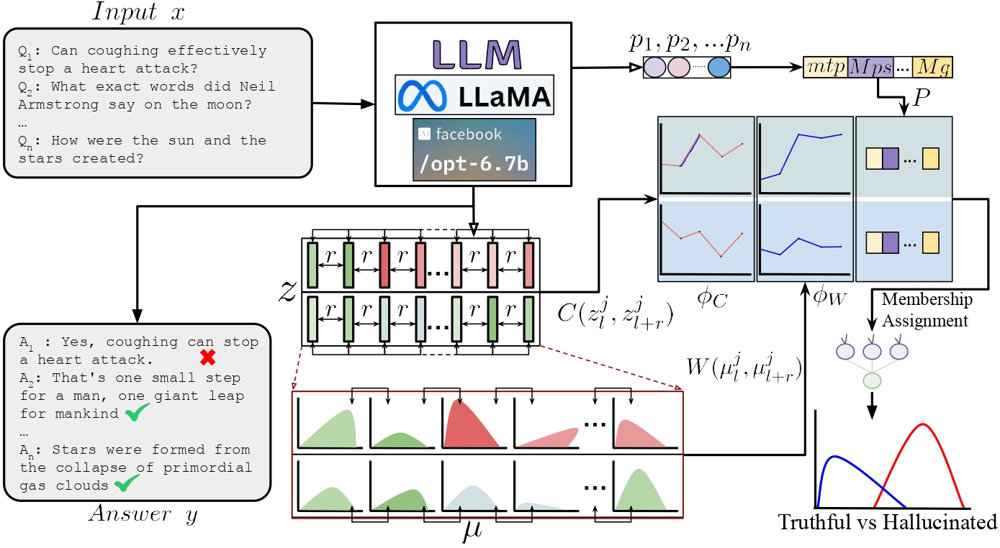

<div align="center">

# 🌟 HalluShift: Measuring Distribution Shifts towards Hallucination Detection in LLMs

[](LICENSE)
[](https://www.python.org/downloads/release/python-31012/)
[](https://ieeexplore.ieee.org/document/11228484)

</div>

This repository contains the source code for the **IJCNN 2025** paper [***HalluShift: Measuring Distribution Shifts towards Hallucination Detection in LLMs***](https://arxiv.org/pdf/2504.09482) by Sharanya Dasgupta, Sujoy Nath, Arkaprabha Basu, Pourya Shamsolmoali, and Swagatam Das.


<div align="center">

<a href="https://arxiv.org/pdf/2504.09482">
  
</a>
</div>


## 📖 **Overview**

**HalluShift** detects LLM hallucinations by measuring distribution shifts and cosine similarities across internal hidden states and attention layers, combined with token-level uncertainty metrics, to distinguish between truthful and fabricated responses.

## 🛠️ **Model Preparation**

1. **📦 Setup Environment**  
   - Install `Python 3.10.12` and the necessary packages from `requirements.txt`.
   - For easily managing different python versions, we recommend using [conda](https://docs.anaconda.com/miniconda/install/).
   - Create a new environment in conda and install necessary python packages:
     ```bash
     conda create -n hallushift python=3.10.12 -y
     conda activate hallushift
     pip install -r requirements.txt
     ```
2. **🔑 Create HF Access Token**
   - Login to `huggingface` or create an account if you don't have already.
   - From the [settings](https://huggingface.co/settings/tokens) create a new access token with WRITE access.
   - Open the `hal_detection.py` and paste your access token at `line 15, hf_token = "<INPUT_YOUR_HF_ACCESS_TOKEN>"`

---

## **📊 Generating Responses and Hallucination Detection**

1. **📁 Setup Necessary Directoriess**  
   Create a folder to save:
   - LLM-generated answers and Ground truth labels for model-generated content
   - Features for training classifiers
   ```bash
   mkdir results
   ```
   Create another folder, where you need to place BleuRT models in the next step. And llm models will be automatically saved while running the script.
   ```
   mkdir models
   ```

2. **✅ Ground Truth Evaluation**  
   Since generated answers lack explicit ground truth, we use [BleuRT](https://arxiv.org/abs/2004.04696) to evaluate truthfulness.
   - To install BleuRT run:
   ```
   pip install --upgrade pip  # ensures that pip is current
   git clone https://github.com/google-research/bleurt.git
   cd bleurt
   pip install .
   ```
   - We are using 12-layer distilled model for faster inference, which is ~3.5X smaller.
   - Download the model and save it in the `./models` folder:
   ```
   wget https://storage.googleapis.com/bleurt-oss-21/BLEURT-20-D12.zip
   unzip BLEURT-20-D12.zip
   mv BLEURT-20-D12 models/. # Move the bleurt model folder to models directory
   ```
   - If you want to use any different model please refer to [BleuRT repository](https://github.com/google-research/bleurt).

3. **🔍 Hallucination Detection for TruthfulQA**  
   To perform hallucination detection on the **TruthfulQA** dataset run the following command:
   ```bash
   python hal_detection.py --dataset_name truthfulqa --model_name llama2_7B 
   ```
   - `dataset_name`: Choose from `truthfulqa`, `triviaqa`, `tydiqa`, `coqa`, `haluevalqa`, `haluevaldia`, `haluevalsum`.
   - `model_name`: Choose from [`llama2_7B`](https://huggingface.co/meta-llama/Llama-2-7b-hf), [`llama3_8B`](https://huggingface.co/meta-llama/Llama-3.1-8B), [`opt6.7B`](https://huggingface.co/facebook/opt-6.7b), [`vicuna_7B`](https://huggingface.co/lmsys/vicuna-7b-v1.5) or [`Qwen2.5_7B`](https://huggingface.co/Qwen/Qwen2.5-7B).
   - To use a different LLM, add its corresponding path to the `MODELS_NAMES` dictionary in `hal_detection.py`.
   - To use a different dataset, update the `load_dataset_by_name` function in `hal_detection.py`. Ensure that it returns a `datasets.Dataset` object. 
   
   **Note:** If you encounter memory errors, consider reducing the number of workers using the `--num_workers` parameter. For example:
   ```bash
   python hal_detection.py --dataset_name truthfulqa --model_name llama2_7B --num_workers 1
   ```
   Refer to Section IV of the paper for implementation details.

---
* **🎮 Demo**
   To quickly evaluate the pre-trained model on the TruthfulQA dataset (which has already been processed and inferred using the LLaMA-2 7B model), run the following command:
   ```bash
   cd demo
   python demo.py
   ```
   The pre-trained model and the processed dataset are provided in the `demo` folder for easy evaluation.


## 📄 Citation

If you find this code useful for your research, please cite our paper:

```bibtex
@INPROCEEDINGS{dasgupta2025hallushift,
  author={Dasgupta, Sharanya and Nath, Sujoy and Basu, Arkaprabha and Shamsolmoali, Pourya and Das, Swagatam},
  booktitle={2025 International Joint Conference on Neural Networks (IJCNN)}, 
  title={HalluShift: Measuring Distribution Shifts towards Hallucination Detection in LLMs}, 
  year={2025},
  volume={},
  number={},
  pages={1-8},
  keywords={Uncertainty;Accuracy;Large language models;Neural networks;Coherence;Benchmark testing;Cognition;Fake news;hallucination detection;distribution shift;large language models;token probability},
  doi={10.1109/IJCNN64981.2025.11228484}}
```